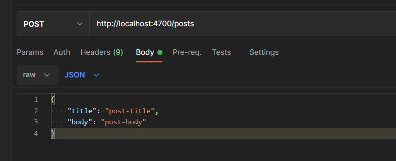

# Node.js - Laboratorium 1

## `Express` (https://expressjs.com/)

Web framework pozwalający w łatwy i szybki sposób postawić serwer HTTP w środowisku NodeJS.

### Pierwsze kroki

1. `npm install express`
2. zaimportowanie modułu do aplikacji i odpowiednie użycie:
```javascript
const express = require('express');

const app = express(); // tworzymy nową instancję serwera

// dodajemy regułę do naszego serwera
// jeżeli użytkownik wejdzie na nasz web serwer
app.get('/', (req, res) => {
    // wysyłamy do klienta dane
    res.send('hello world!');
});

app.listen(4700); // uruchamiamy nasz web serwer na porcie 4700
```

## `express.Router` (https://expressjs.com/en/4x/api.html#router)

```javascript
const express = require('express');
const app = express();
const router  = express.Router(); 

router.use((req, res, next) => {
    // ...
    next();
});

router.get('/', (req, res) => {
    // ...
    res.send('hello world!');
});

app.use(router);

app.listen(4700);
```

## Parsowanie ciała zapytania

https://expressjs.com/en/api.html#express.json

https://expressjs.com/en/api.html#express.urlencoded

```javascript
const express = require('express');
const app = express();

app.use(express.json())

app.post('/', (req, res) => {
    const name = req.body.name;
    // ...
    res.send(`hello ${name}!`);
});

app.listen(4700);
```

## Zadania do wykonania

1. Stwórzmy pierwszą aplikację serwerową z użyciem frameworka `Express`. Gdy żądanie zawiera parametr `name`, powitajmy naszego użytkownika po imieniu zwracając `Hello {wartość_parametru_name}`. (http://localhost:4700?name=Jan).

2. Stwórzmy aplikację która pobierając 2 parametry `a` i `b` z adresu url (http://localhost:4700/2/3) wykona mnożenie. Rezultat działania powinniśmy wysłać do klienta. 

3. Rozszerzmy naszą aplikację z zadania 2 o dodatkowe działania matematyczne takie jak dodawanie, dzielenie i odejmowanie. Podzielmy zadania na odpowiednie ścieżki.

```bash
// http://localhost:4700/mnozenie/4/5
// http://localhost:4700/dzielenie/4/5
// http://localhost:4700/dodawanie/4/5
// http://localhost:4700/odejmowanie/4/5
```
4. Stwórzmy aplikację której zadaniem będzie operacja na tablicy zawierającej użytkowników
    - 'końcówka' `/add` niech służy do dodawania użytkownika i przyjmuje parametry `?name=Jan&username=janko&email=jan@nowak.abc`
    - dodajmy ścieżkę zwracającą wszystkich użytkowników
    - dodajmy końcówkę która wyświetla dane pojedynczego użytkownika na podstawie parametru `id` wysłanego przez klienta
    - rozszerzmy aplikację o kasowanie użytkownika

5. Wzorując się na zadaniu 4 stwórzmy analogicznie obsługę tablicy zawierającej posty. Tym razem aby dodać post obsłużymy metodę POST i dane przesyłane w body żądania. Aplikacja ma rozszerzyć naszą już istniejącą aplikację z zadania 4.

Struktura body `POSTu`:
```javascript
{
    title: '',
    body: ''
}
```

Wysłanie JSON za pomocą Postmana (odpowiedni nagłówek content-type zostanie ustawiony automatycznie)


6. Podzielmy odpowiednio naszą aplikację z zadania 5 wykorzystując `express.Router` https://expressjs.com/en/4x/api.html#router

7. Zmodyfikujmy zadanie 6 tak by adres zwracający dane pojedynczego użytkownika zwracał różne format danych w zależności od nagłówka żądania Accept (przykładowe nagłówki: text/plain, text/html, application/json). Należy użyć funkcji res.format().

Ustawienie nagłówka żądania Accept:

