# Node.js - Laboratorium 3

## Moduł npm `dotenv` (https://github.com/motdotla/dotenv#readme)
```javascript
require('dotenv').config();

// pobranie wartości zmiennej
const uri = process.env.MY_VARIABLE;

```

plik .env
```
MY_VARIABLE=my-variable-value
```

## `MongoDB` (https://www.mongodb.com/)

Darmowa baza danych *w chmurze* https://www.mongodb.com/atlas

Instrukcja instalacji lokalnej bazy danych: (dla chętnych) https://www.mongodb.com/docs/manual/tutorial/install-mongodb-on-windows/

## `MongoDB Node.JS Driver` (https://docs.mongodb.com/drivers/node/current/)

Moduł do komunikacji aplikacji Node.js z bazą danych MongoDB

Dokumentacja podstawowa: https://www.mongodb.com/docs/drivers/node/current/

Dokumentacja szczegółowa: https://mongodb.github.io/node-mongodb-native/6.5/

### stworzenie instancji klienta `MongoDB`
```javascript
const { MongoClient, ServerApiVersion } = require('mongodb');
const uri = "connection_string";

const client = new MongoClient(uri, { useNewUrlParser: true, useUnifiedTopology: true, serverApi: ServerApiVersion.v1 });
async function main() {
    await client.connect();
    //...
}

main()
  .then(console.log)
  .catch(console.error)
  .finally(() => client.close());
```

### pobranie z kolekcji wszystkich użytkowników
```javascript
    //...
    await client.connect();
    const usersCollection = client.db("mydatabase").collection("users");

    const findResult = await usersCollection.find().toArray();
    console.table(findResult); 
    //...
```

## Zdalna baza: Atlas MongoDB (https://www.mongodb.com/cloud/atlas/register)
uzupełniamy formularz na stronie
https://www.mongodb.com/cloud/atlas/register

czekamy na mail z dalszą instrukcją, następnie logujemy się na https://account.mongodb.com
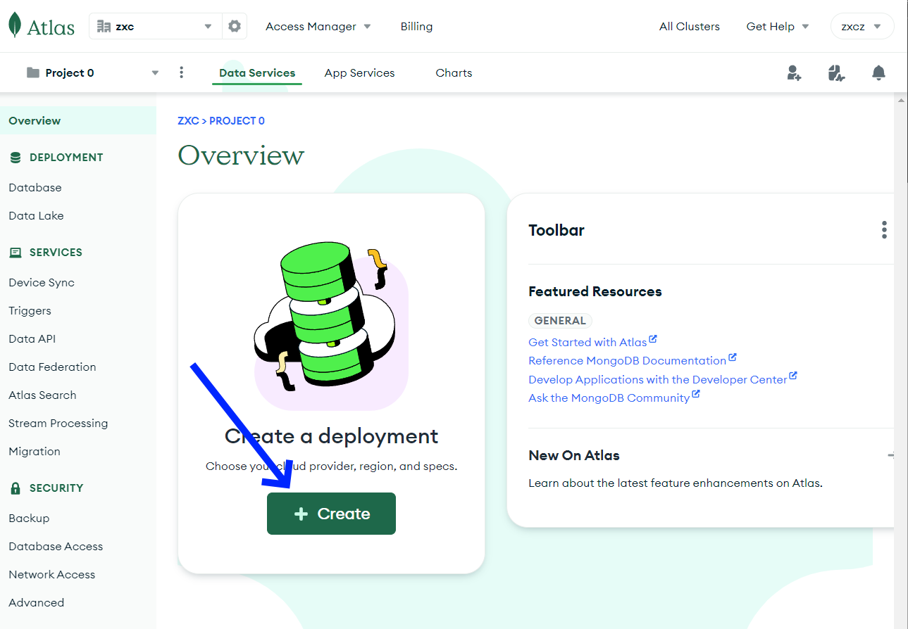

tworzymy nowy klaster (kontener dla baz danych)
    
    - wybieramy pakiet bezpłatny
    - wybieramy lokalizację najbliższą geograficznie 
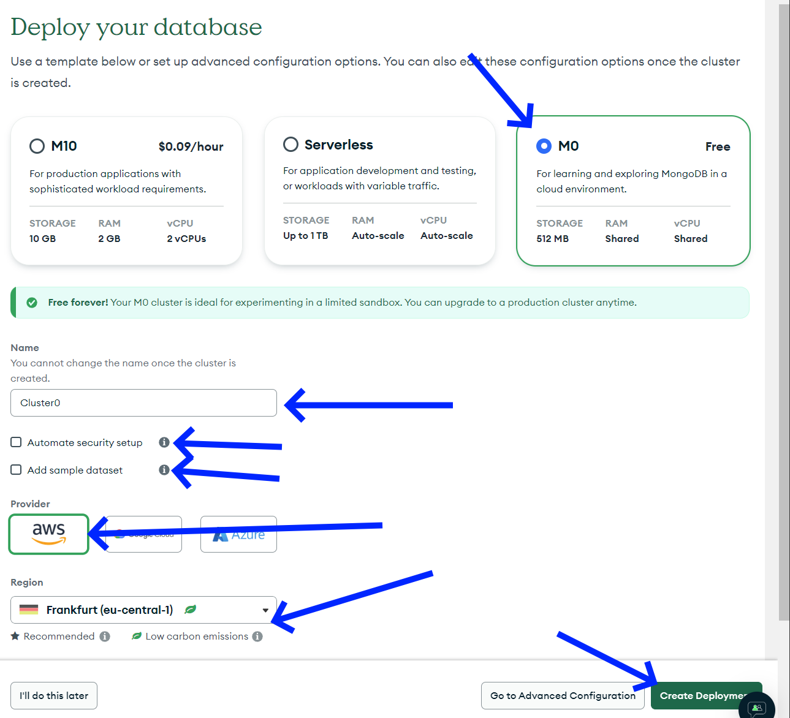

zezwalamy na dostęp z dowolnego adresu IP (tylko na potrzeby edukacyjne, w pracy nigdy tak nie robimy!)
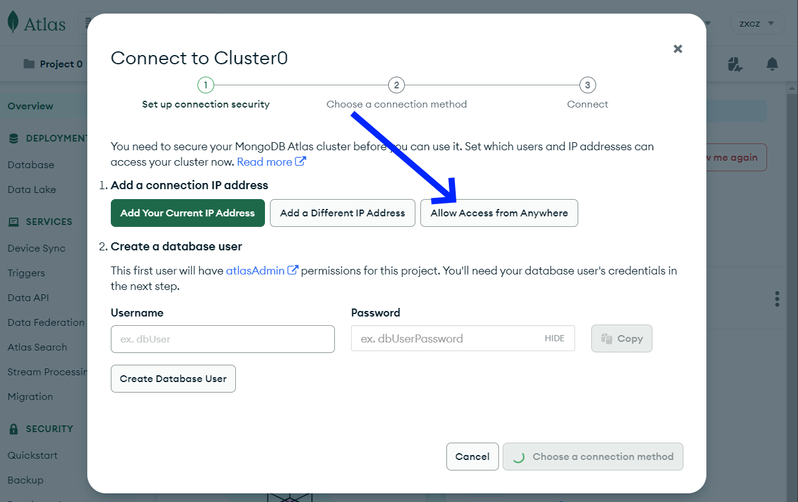

dodajemy użytkownika bazy danych
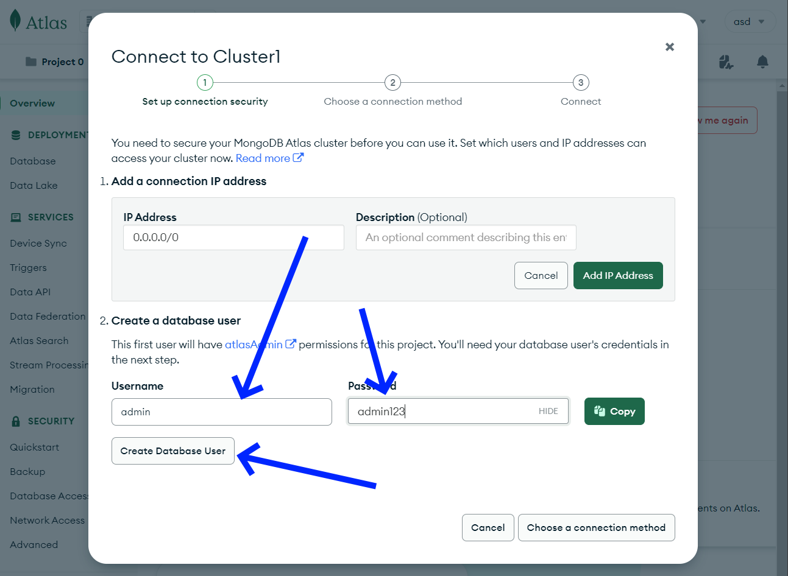

wybieramy sposób połączenia
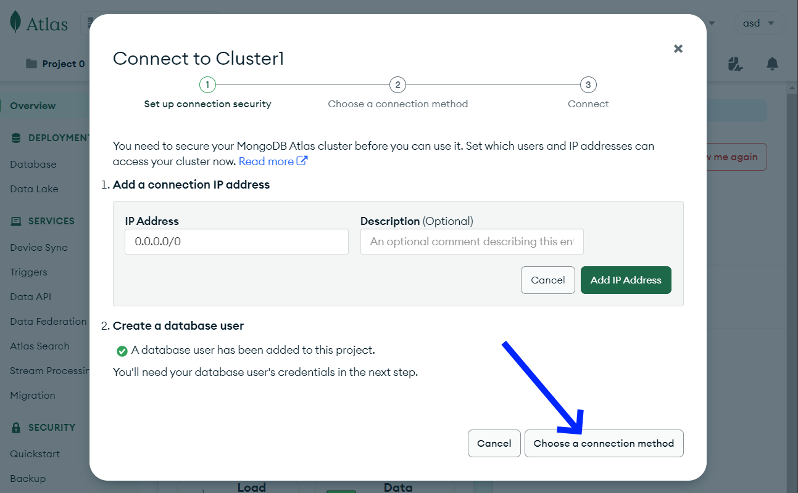

wybieramy drivers
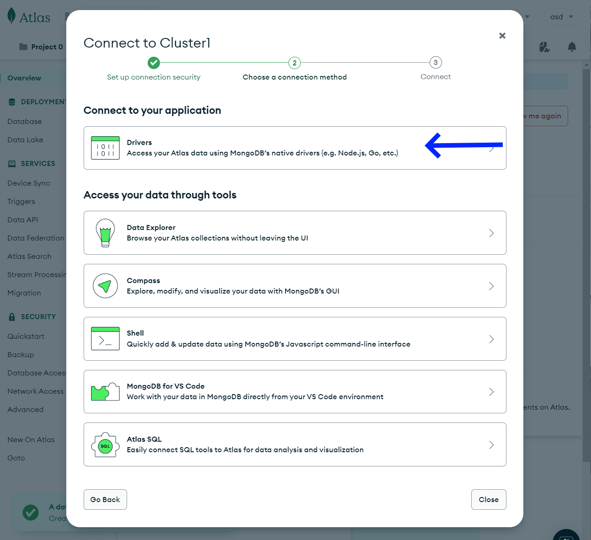

pobieramy przykładowy kod javascript do połączenia się z bazą danych
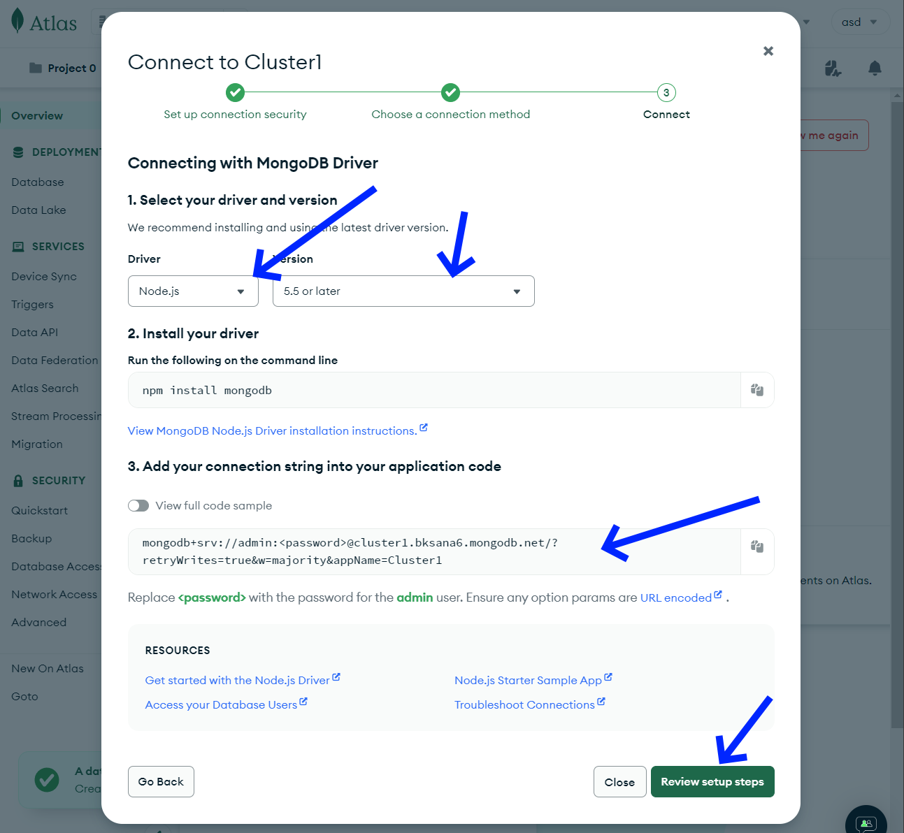

należy pamiętać, że w pobranym kodzie trzeba uzupełnić oprawną nazwę użytkownika bazy danych i jego hasło
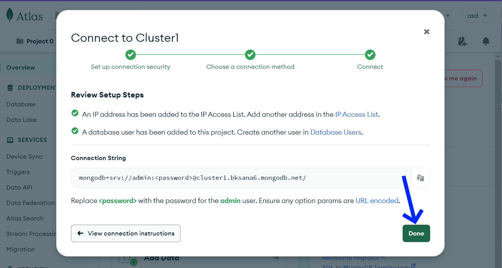

wybieramy opcje dodania bazy danych
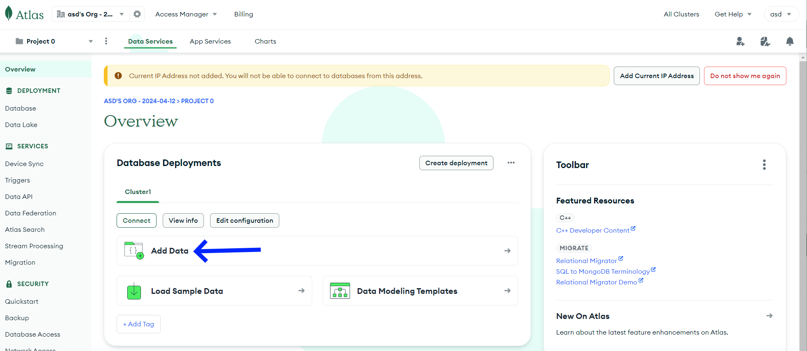

wybieramy utworzenie własnej bazy
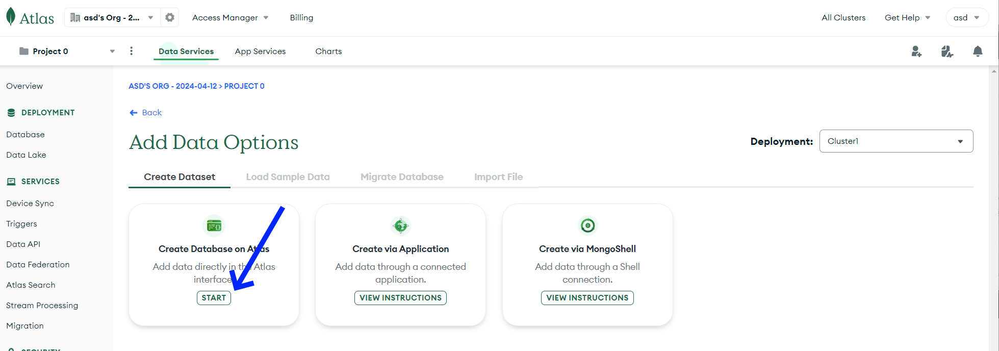

wybieramy nazwę naszej bazy oraz kolekcji
zazwyczaj baza jest wspólna dla całej aplikacja kolekcja przechowuje konkretny zbiór danych (użytkownicy, produkty itp)
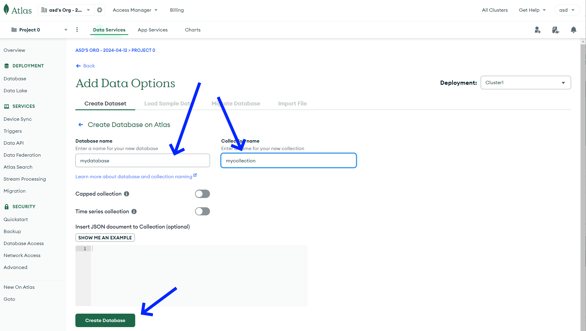

dodajemy dane do kolekcji
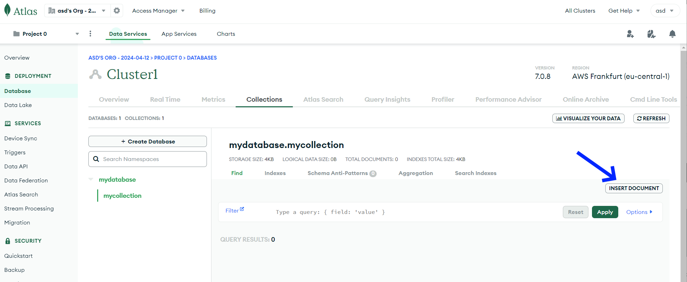

wpisujemy dane
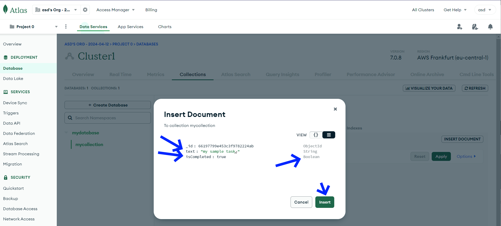

widzimy dane zapisane w bazie
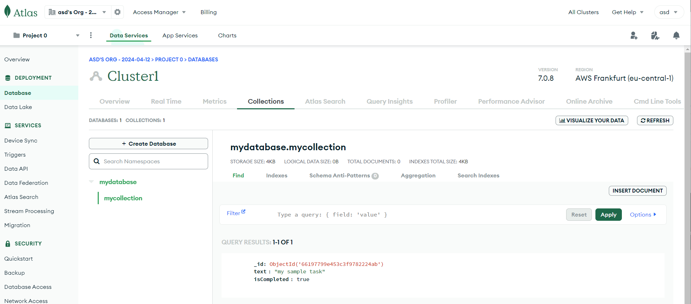

## krok opcjonalny
zdarza się, że komunikacja z bazą jest blokowana mimo poprawnie ustawionego filtrowania IP, rozwiązaniem może być ponowne ustawienie reguł:
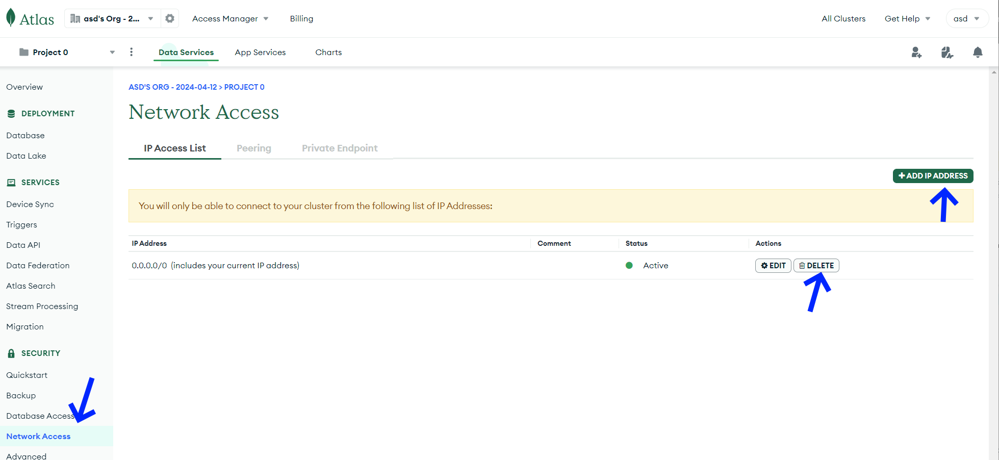

## Zadania do wykonania

1. Stwórzmy aplikację która będzie wyświetlała wartość zmiennych środowiskowych, pobranych z pliku `.env`. W tym celu użyjemy modułu `npm` `dotenv`

2. Stwórzmy bazę danych `MongoDB` w chmurze. W tym celu powinniśmy założyć konto wykorzystując formularz: https://www.mongodb.com/cloud/atlas/register 

    Trzeba pamiętać aby dodać swoje IP do odpowiedniej reguły zapory ('white list')!

    Do przygotowanej bazy powinniśmy spróbować nawiązać połączenie wykorzystując moduł `mongodb`. (przykład użycia jest umieszczony we wskazówkach laboratorium).
